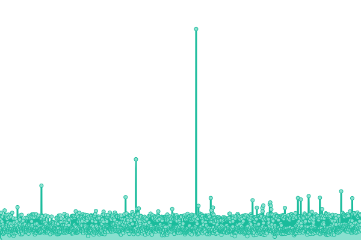
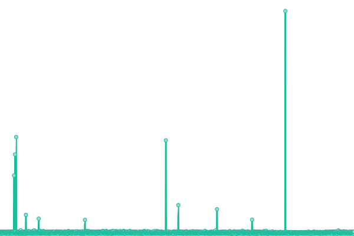
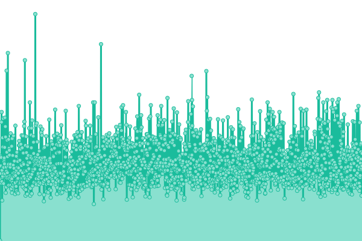
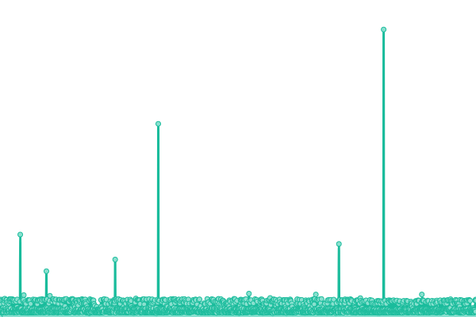
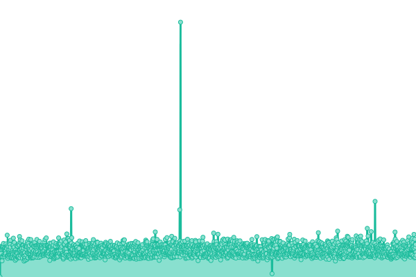
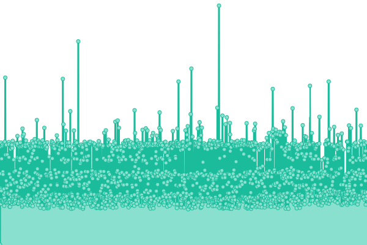
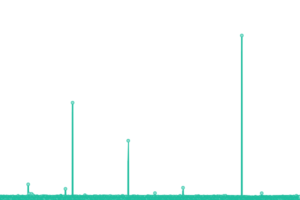

# [📈 Live Status](https://demo.upptime.js.org): <!--live status--> **🟩 All systems operational**

This repository contains the open-source uptime monitor and status page for [BrantLab](https://demo.upptime.js.org), powered by [Upptime](https://github.com/upptime/upptime).

With [Upptime](https://upptime.js.org), you can get your own unlimited and free uptime monitor and status page, powered entirely by a GitHub repository. We use [Issues](https://github.com/BrantLab/upptime/issues) as incident reports, [Actions](https://github.com/BrantLab/upptime/actions) as uptime monitors, and [Pages](https://demo.upptime.js.org) for the status page.

<!--start: status pages-->
<!-- This summary is generated by Upptime (https://github.com/upptime/upptime) -->
<!-- Do not edit this manually, your changes will be overwritten -->
<!-- prettier-ignore -->
| URL | Status | History | Response Time | Uptime |
| --- | ------ | ------- | ------------- | ------ |
|  [BrantLab](https://brantlab.com) | 🟩 Up | [brant-lab.yml](https://github.com/Brantlab/upptime/commits/HEAD/history/brant-lab.yml) | 

 142ms
     
 | 

<a href="https://upptime.brantlab.com/history/brant-lab">100.00%</a>
    

|  [Convoy Fire & EMS](https://convoyfireandems.com) | 🟩 Up | [convoy-fire-and-ems.yml](https://github.com/Brantlab/upptime/commits/HEAD/history/convoy-fire-and-ems.yml) | 

 302ms
     
 | 

<a href="https://upptime.brantlab.com/history/convoy-fire-and-ems">100.00%</a>
    

|  [Emergency Reporting](https://emergencyreporting.com) | 🟩 Up | [emergency-reporting.yml](https://github.com/Brantlab/upptime/commits/HEAD/history/emergency-reporting.yml) | 

 193ms
     
 | 

<a href="https://upptime.brantlab.com/history/emergency-reporting">100.00%</a>
    

|  [Dispatch Recordings](https://dispatch.brantlab.com) | 🟩 Up | [dispatch-recordings.yml](https://github.com/Brantlab/upptime/commits/HEAD/history/dispatch-recordings.yml) | 

 574ms
     
 | 

<a href="https://upptime.brantlab.com/history/dispatch-recordings">100.00%</a>
    

|  Secret Software | 🟩 Up | [secret-software.yml](https://github.com/Brantlab/upptime/commits/HEAD/history/secret-software.yml) | 

 574ms
     
 | 

<a href="https://upptime.brantlab.com/history/secret-software">100.00%</a>
    

|  [RAC](https://rac.grunetworks.xyz) | 🟩 Up | [rac.yml](https://github.com/Brantlab/upptime/commits/HEAD/history/rac.yml) | 

 288ms
     
 | 

<a href="https://upptime.brantlab.com/history/rac">100.00%</a>
    

|  [Convoy Daycare](https://Convoydaycare.com) | 🟩 Up | [convoy-daycare.yml](https://github.com/Brantlab/upptime/commits/HEAD/history/convoy-daycare.yml) | 

 333ms
     
 | 

<a href="https://upptime.brantlab.com/history/convoy-daycare">100.00%</a>
    

<!--end: status pages-->

[**Visit our status website →**](https://demo.upptime.js.org)

## 📄 License

- Powered by: [Upptime](https://github.com/upptime/upptime)
- Code: [MIT](./LICENSE) © [BrantLab](https://demo.upptime.js.org)
- Data in the `./history` directory: [Open Database License](https://opendatacommons.org/licenses/odbl/1-0/)
